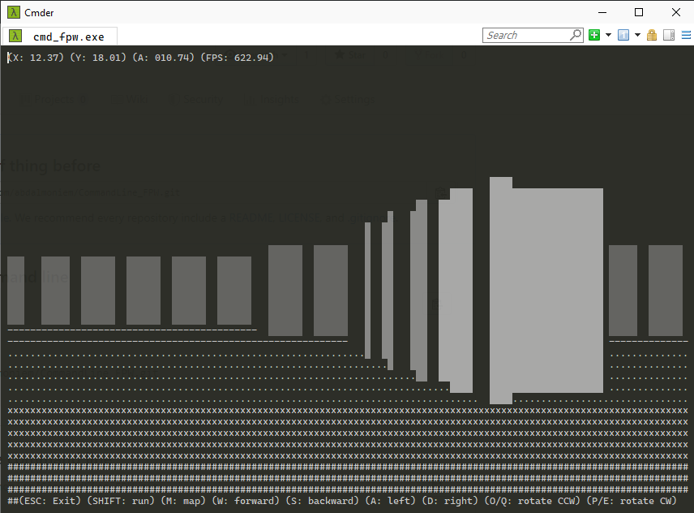
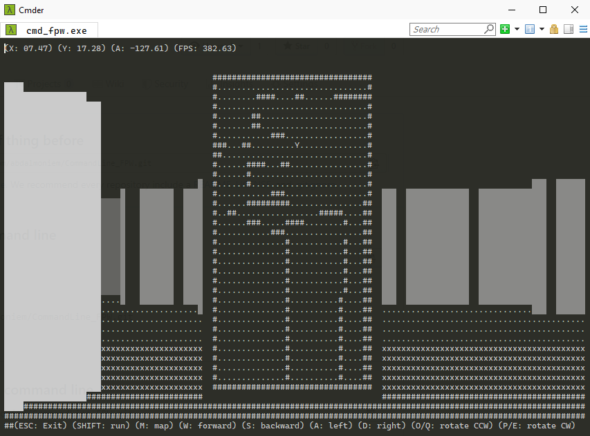

# Command Line First Person Walker (CMD_FPW)

## Introduction
Ever since I played DOOM the original and Wolfenstein 3D I wanted to know how these games were made and what technologies they used. And after many many years I finally knew what and how they were made. They used a technique called ray casting, which means that these games faked 3D and were not true 3D games.

## Ray Casting
Ray casting is the use of ray–surface intersection tests to solve a variety of problems in 3D computer graphics and computational geometry. The term was first used in computer graphics in a 1982 paper by Scott Roth to describe a method for rendering constructive solid geometry models.

The ray casting algorithm uses artificial rays shot from a source in all directions in the field of vision of a player, when these rays hit a wall on the map it is drawn as a coloumn in the view of the player, the closer the distance betwen the source (which is the player) and the wall the longer this coloumn is drawn on the screen.

## The Game
CMD_FPW is a game played from the command line. in this version you only walk about the room freely without enemies or an hurdles. this game is made only for the purpose of demonestrating ray casting.

### Modes

#### 1. Explore
in this mode you only walk around a fixed map room and see how ray casting is working in action.

#### 2. Random
in this mode you only walk around a randomly generated map room and see how ray casting is working in action.

#### 3. Maze
in this mode you only walk around a maze room and try to exit the maze.

### Recommended Gameplay Settings
This program expects the console dimensions to be set to 120 Columns by 40 Rows. I recommend a small font (Consolas for example) at size 16. You can do this by right clicking on the console title bar, and specifying the properties. You can also choose to default to them in the future. I also recommend using [Cmder](https://cmder.net/) since the default windows command prompt isn't capable of displaying unicode characters.

### Screenshots

